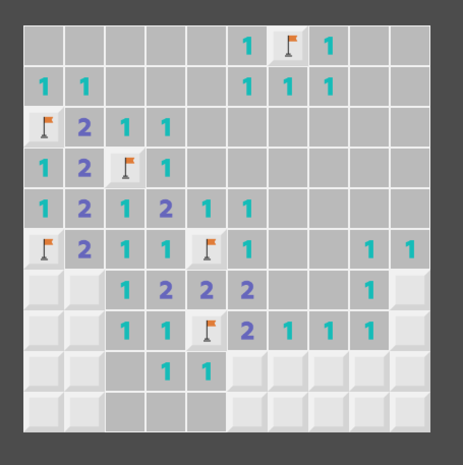

# junior-challenge
Тестовое задание

## Общая информация
Тестовое задание "Сапер" представляет из себя готовую игру на Godot, которую нужно дописать согласно тз.
Предполагается, что задание можно сделать за 6 часов. (1 час на освоение движка, 2 часа на документацию, 3 часа на задания)

Игру необходимо запускать на движке Godot (https://godotengine.org/) последней стабильной версии (3.3).

## Реализация игры
Игра сделана по тз: https://docs.google.com/document/d/1S9oCfDpdKV3hTjPz_mHC_dboJzD3TcnXX1dC2h9bsJY/edit?usp=sharing

Игра разбита на 2 сцены и 5 скриптов, они все находятся в директории logic
- `cell.gd` - скрипт клетки. Отвечает за её отображение
- `cell.tscn` - сцена одной клетки
- `constants.gd` - синглтон с константами
- `desk.gd` - скрипт доски. Отвечает за создание игрового поля и обеспечивает к нему легкий доступ
- `game.gd` - основной скрипт игры. Реагирует на нажатия клеток, выводит финальный экран.

- `level_generator.gd` - сюда вынесена генерация уровня
- `main_scene.tscn`  - Основная сцена игры.

## Задание
0. Разобраться в игре
- Скачать движок, запустить проект, сыграть в несколько игр
- Разобраться, какая часть кода за что отвечает (брейкпоинты при этом очень помогут)
1. При первом клике на поле игра выводит в консоль расположение всех бомб, и это ломает весь игровой процесс. Убрать лишний вывод из программы.
1. Если нажать на флажок с бомбой - игра заканчивается. Изменить программу так, чтобы клик левой мышкой не открывал ячейку, отмеченную флагом.
1. Если играть и активно ставить флажки - игра заканчивается раньше, чем будут найдены все бомбы. Исправить: игра должна заканчиваться в тот момент, когда количество закрытых клеток равно количеству бомб.
1. При клике на пустое поле открываются только пустые ячейки. Нужно изменить код, чтобы игра соответствовала оригинальному Саперу: при клике на пустое поле открываются все пустые ячейки и прилегающие к ним цифры.
1. Предложить ещё два-три своих улучшения, которые можно сделать в игре. Они могут относится к геймплею, визуальной части или к коду. Напишите ваши идеи в этот `README`.

## Отправка решения
Нажми на кнопку `Use this template` и создай приватный репозиторий github.

Пригласи в него своих интервьюеров из Funexpected.
Решение каждого задания нужно оформить отдельным коммитом. Корректная история коммитов (информативные названия, отсутствие мусора) будет плюсом.

## Советы
- Рекомендуем внимательно прочитать [туториалы](http://docs.godotengine.org/en/stable/), особенно разделы [Step by Step](http://docs.godotengine.org/en/stable/getting_started/step_by_step/index.html)
- Понять, как работает код, часто можно с помощью точек останова (breakpoints) в редакторе Godot

## Обратная связь
Мы приветствуем вопросы, возникающие при решении задания. Особенно - хорошо сформулированные. Чтобы нам было удобно отвечать, задавайте все вопросы за день в одном сообщении. Задавая вопрос, убедитесь, что вы потратили разумное время на самостоятельный поиск ответа.

Успехов! :)
